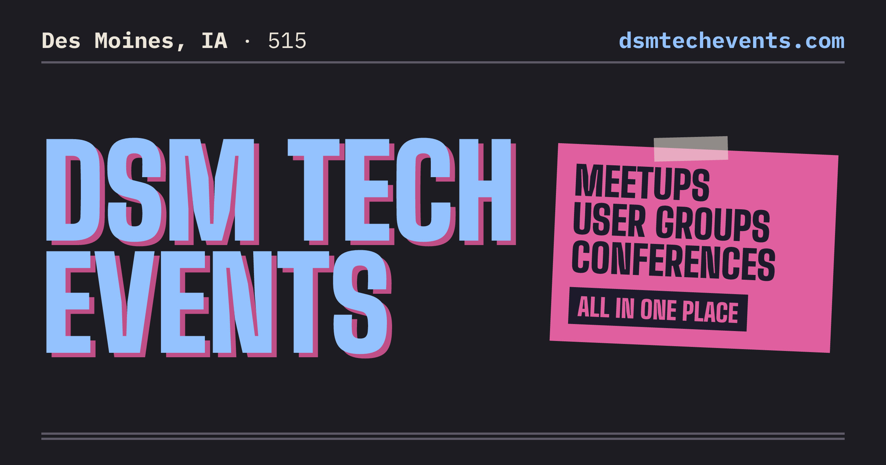
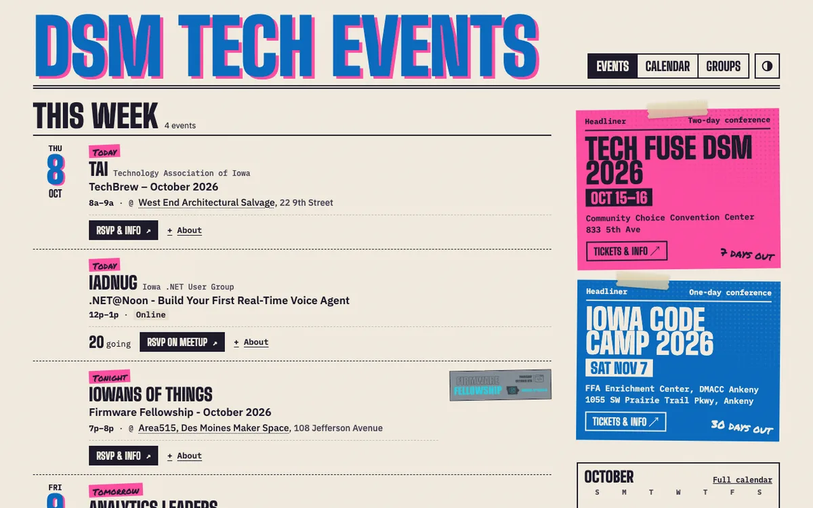
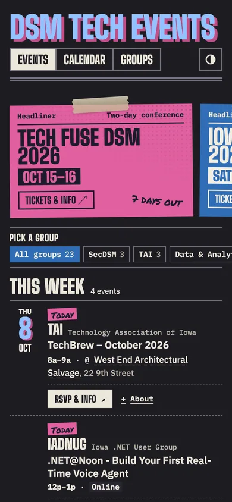
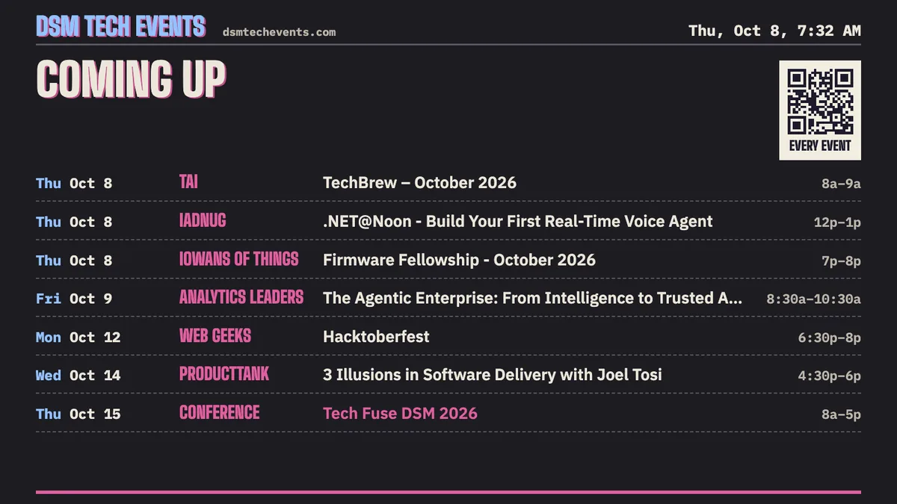
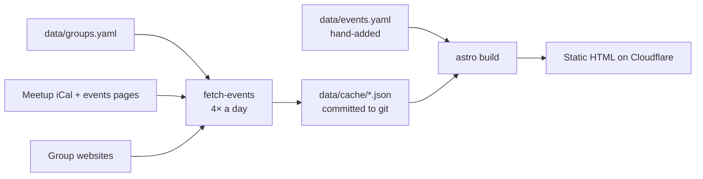

<a href="https://dsmtechevents.com"></a>

<p align="center">
  <a href="https://dsmtechevents.com"><strong>dsmtechevents.com</strong></a>
  &nbsp;·&nbsp; <a href="https://dsmtechevents.com/add/">Add your group</a>
  &nbsp;·&nbsp; <a href="docs/ARCHITECTURE.md">Architecture</a>
  &nbsp;·&nbsp; <a href="CONTRIBUTING.md">Contributing</a>
</p>

<p align="center">
  <a href="https://github.com/kylehoehns/dsmtechevents/actions/workflows/ci.yml"></a>
  <a href="https://github.com/kylehoehns/dsmtechevents/actions/workflows/refresh.yml"></a>
  <a href="LICENSE"></a>
</p>

# DSM Tech Events

One place to see every upcoming Des Moines tech meetup, user group and
conference. It's a static site on Cloudflare that refreshes itself four times
a day from each group's Meetup calendar or, for groups not on Meetup, their
own website. Nobody has to keep it up to date by hand.

It's a pointer, not a ticket booth: people find what's on here, then RSVP on
the group's own page.

<table>
  <tr>
    <td width="72%"></td>
    <td width="28%"></td>
  </tr>
</table>

### What's in it

| | What you get |
|---|---|
| **Event list** | This week, next week, the rest of the month and further out, with Today / Tonight / Tomorrow tags, joint meetups merged, and repeating series folded into one row. |
| **Calendar** | A month grid with a day panel, fully keyboard-navigable. |
| **Groups** | Every group with its next meetup, members and a link to its own page. |
| **Headliners** | Conferences get a taped-up poster with a countdown. |
| **Lobby TV** (`/tv/`) | A self-running slideshow for a screen at a coworking space or venue, with QR codes. Arrow keys step through it, space pauses. |
| **Print flyer** (`/print/`) | One Letter page with tear-off tabs, for a real corkboard. |
| **Light and dark**, offline, installable | A service worker keeps the last copy; it installs as an app. |

<p align="center"></p>

### At a glance



Astro · plain JavaScript · Node's test runner · Playwright + axe · Cloudflare Workers.
No database, no accounts, no tracking cookies.

## How it works

Every few hours, a GitHub Action visits every group's Meetup calendar (or
its website, for groups not on Meetup), saves what it finds to
`data/cache/`, and commits it. That commit rebuilds and redeploys the site,
so what's live always matches what's in git.

If a group's page breaks, the site keeps showing that group's last good
events and opens a GitHub issue about it. Everyone else carries on as normal.

The full tour, with a diagram, is in
[docs/ARCHITECTURE.md](docs/ARCHITECTURE.md).

## Get your group or event listed

The easiest way is the [Add your group or event](https://dsmtechevents.com/add/)
page: it says what fits and has the email address (hello@dsmtechevents.com).

Comfortable with GitHub? Open a pull request instead:

- **A group:** add it to `data/groups.yaml` with its Meetup link (and website,
  if it has one). New events then show up on their own.
- **A one-off event**, like a conference: add it to `data/events.yaml`.
  `headliner: true` gives it a poster at the top of the page.

[CONTRIBUTING.md](CONTRIBUTING.md) has the details, including groups that
aren't on Meetup.

## Run it yourself

You need Node 22 or newer.

```sh
npm install
npm run dev      # http://localhost:4321, using the events already in git
npm run fetch    # optional: pull fresh events from every group
npm test         # unit tests
npm run test:e2e # browser tests (run `npx playwright install chromium` once)
```

The tests run on saved copies of each group's pages, never the live
internet, so they give the same answer every time. The browser tests also
check every page for accessibility problems in light and dark mode.

## Where it runs

Cloudflare hosts it as static files, and every merge to `main` deploys. Every
pull request gets its own preview link. The only server code is a tiny
Worker that counts clicks on outbound links, so groups can see how many
people the site sends them. There are no accounts and no tracking cookies.
See [docs/ANALYTICS.md](docs/ANALYTICS.md).

## More docs

- [CONTRIBUTING.md](CONTRIBUTING.md): getting listed, and making a change
- [docs/ARCHITECTURE.md](docs/ARCHITECTURE.md): how the pieces fit, and running it
- [docs/decisions/](docs/decisions/): why it's built this way
- [SECURITY.md](SECURITY.md): reporting a security problem
- [AGENTS.md](AGENTS.md): notes for AI coding assistants working in this repo

## License

MIT. See [LICENSE](LICENSE). Event details belong to the groups that post
them; the site links to each group's own page.
