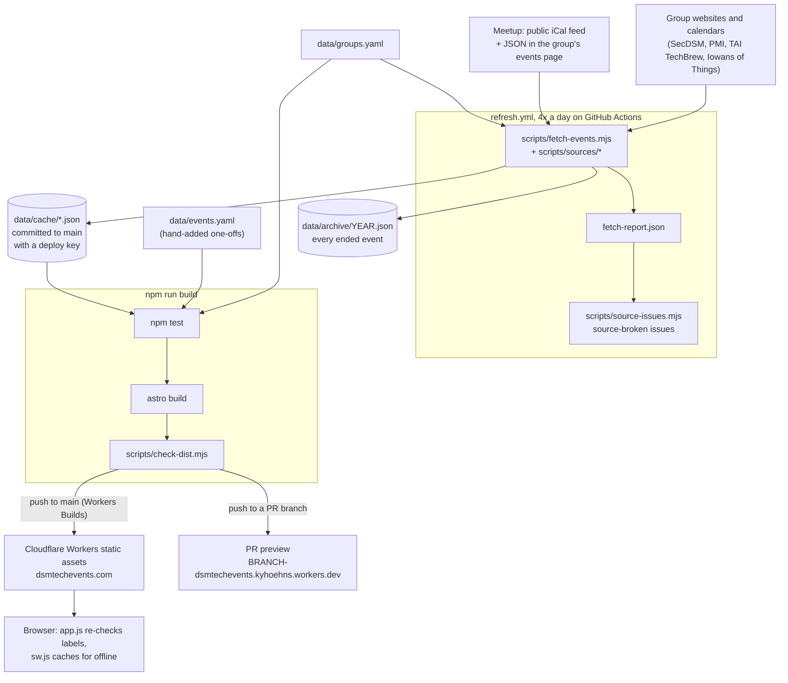

# Architecture

How an event gets from a group's Meetup page to dsmtechevents.com. The
[README](../README.md) has the short version and the commands; the
[decisions](decisions/) say why it is built this way.

## The pieces

- **Fetch.** `scripts/fetch-events.mjs` reads `data/groups.yaml`. A Meetup
  group's upcoming events come from its public iCal feed; its events page
  adds venue, photo, RSVP count and recent past events. A group with
  `source:` uses a reader in `scripts/sources/` instead. Each group's result
  is written to `data/cache/<id>.json`, which keeps 90 days of past
  events. Every ended event is also filed in `data/archive/<year>.json`
  (`scripts/archive.mjs`), the long-term record.
- **Refresh.** `.github/workflows/refresh.yml` runs the fetch at 10:20,
  15:20, 19:20 and 23:20 UTC, runs `npm run build`, and commits
  `data/cache/` and `data/archive/` if they changed. It also writes the Des
  Moines date to `data/cache/built-on.txt`, so it commits at least once a
  day. It pushes
  with a deploy key, the one thing allowed past `main`'s ruleset.
- **Failures.** A group that fails keeps its previous cache file. The fetch
  writes `fetch-report.json`, and `scripts/source-issues.mjs` opens, updates
  or closes one `source-broken` issue per group.
- **Build.** `npm run build` is `npm test`, then `astro build`, then
  `scripts/check-dist.mjs`. `src/lib/data.mjs` merges the cache with
  `data/events.yaml`. The build never touches the network, so the same
  commit always builds the same site.
- **Deploy.** Cloudflare Workers Builds runs the build on every push to
  `main` and serves `dist/` as static assets (`wrangler.jsonc`). Every PR
  branch gets its own preview URL.
- **Weekly link check.** `.github/workflows/links.yml` runs
  `scripts/check-links.mjs` on group and hand-added event links and keeps
  one `broken-link` issue up to date.

## Build time vs. the browser

The build decides almost everything: which events show, the "This week" and
"Next week" groups, joint meetups, and which photos and names to hide.

The page can sit in a browser or a cache for hours after it was built, so
`src/scripts/app.js` re-checks anything tied to the current time. The
Today / Tonight / Tomorrow / Happening now tag (`whenLabel()`) and the
poster countdown (`countdown()`) are printed by the build and recomputed on
load. Both sides import the same functions from `src/lib/format.mjs`. The
browser also handles the group filter, the calendar view and the URL state.
The `/tv/` page labels events in the browser and reloads itself hourly.

Cards for events the list doesn't print in full (past events, repeat dates,
far-off ones) live in `/cards/` (`src/pages/cards.astro`), not the home
page. The calendar's day panel and search fetch it the first time they need
it.

`public/sw.js` is the service worker. Pages and `/cards/` are network-first
with a 3 second fallback to the cached copy. CSS, JS and fonts are
precached from a list of every file in `dist/_astro/`, which
`scripts/sw-precache.mjs` writes into `dist/sw.js` at build time; the
offline e2e project (`tests/e2e/offline.spec.mjs`) is the only one that
lets the worker run. Up to 60 Meetup photos and the Groups page's
Meetup-hosted logos are kept too.

## The cache stability rule

A cache file must not change unless an event changed (the archive follows
the same rule). `mergeCache()` in
`scripts/sources/meetup.mjs` keeps the old `fetchedAt` when nothing else
moved, and optional facts (`members`, `pastCount`, `lastMet`) are left out when unknown
rather than written as `null`. If a file changed on every run, every
refresh would commit and redeploy the site four times a day for nothing.

## Time zones

Everything is shown in Des Moines time, wherever the viewer is.

- `src/lib/site.mjs` sets `timeZone: 'America/Chicago'`.
- Cache files store start and end as UTC ISO strings. Meetup's and other
  iCal feeds are parsed in `scripts/sources/ical.mjs` with `node-ical`,
  which handles their time zones.
- Local dates and times (from `data/events.yaml` and the website readers)
  become UTC through `localToUtc()` in `src/lib/time.mjs`.
- Display and day math go through `src/lib/format.mjs`, used by the build,
  `app.js` and the TV page.
- `refresh.yml` writes `built-on.txt` with `TZ=America/Chicago`.

## Running it

- **Refresh now** instead of waiting for the next scheduled run:
  `gh workflow run refresh.yml`.
- **The deploy key.** `main` takes no direct pushes; the refresh workflow is
  the one exception. It pushes event data with a deploy key (secret
  `REFRESH_DEPLOY_KEY`), and the ruleset lets deploy keys bypass it. To
  rotate it, make a new key with `ssh-keygen -t ed25519`, add the public half
  under Settings → Deploy keys with write access, and replace the secret.
- **A broken source** opens one `source-broken` issue for that group
  (`scripts/source-issues.mjs`), updated rather than duplicated, and closed
  automatically once the group fetches cleanly. Fix it by saving a trimmed
  copy of the new page in `tests/fixtures/` and updating the reader until its
  test passes.
